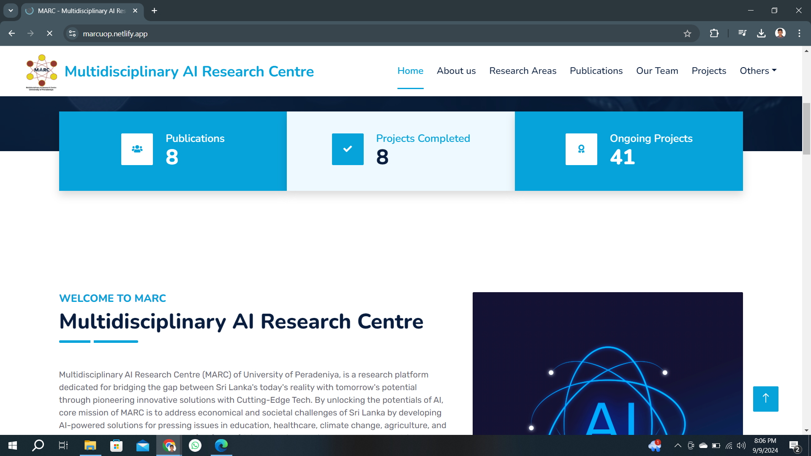
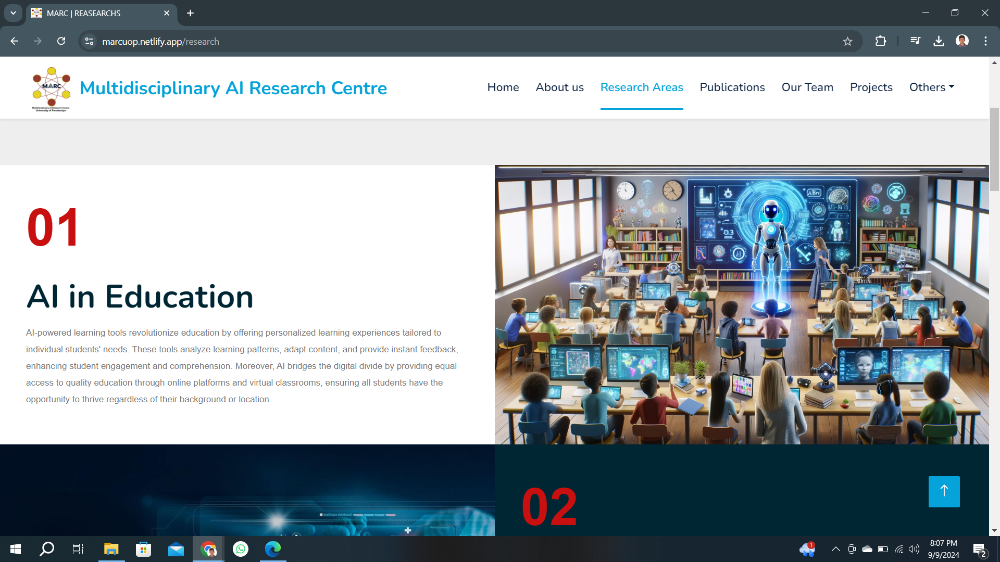
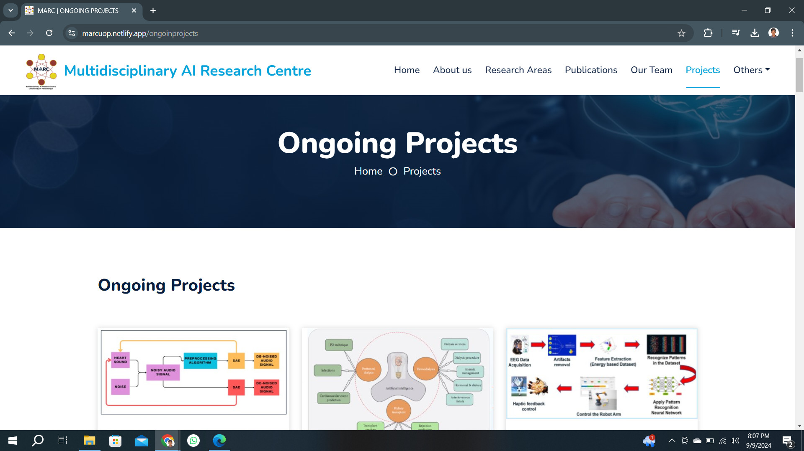

# Multidisciplinary AI Research Centre - University of Peradeniya

This repository contains the code for the official website of the Multidisciplinary AI Research Centre (MARC) at the University of Peradeniya. The website is designed to showcase research activities, projects, and collaborations of the center, and to provide a platform for outreach and engagement with the broader academic and research community.

## Table of Contents

- [Features](#features)
- [Technologies Used](#technologies-used)
- [Installation](#installation)
- [Usage](#usage)
- [Folder Structure](#folder-structure)
- [Contributing](#contributing)
- [License](#license)

## Features

- **Research Showcase:** Highlight key research areas and ongoing projects.
- **Team Members:** Display profiles of researchers and staff members.
- **News & Events:** Publish updates on upcoming events, conferences, and seminars.
- **Publications:** Provide a platform to share research papers and publications.
- **Contact Information:** Simple form for visitors to reach out to the center.

## Technologies Used

- **HTML5:**  For structuring content on the website.
- **CSS3:** For styling and layout design.
- **JavaScript:** For interactivity and dynamic content.
- **Responsive Design:** Ensures the site is accessible and functional across a range of devices.

## Installation

1. **Clone the repository:**

    ```bash
    git clone https://github.com/yourusername/marc-website.git
    cd marc-website
    ```

2. **Open the `index.html` file in your preferred browser:**

    ```bash
    open index.html
    ```

## Usage

Once the repository is cloned, you can customize the content as needed:

- **HTML Files:** Edit content in the HTML files located in the root folder.
- **CSS Files:** Modify the styles in `styles.css` located in the `css` folder.
- **JavaScript Files:** Adjust any interactive elements by editing the JavaScript files located in the `js` folder.

## Screenshots

<br>
<br>

<br>
<br>

<br>
<br>

<br>
<br>

<br>
<br>

<br>
<br>

<br>
<br>



## Folder Structure

```bash
├── index.html           # Main entry point of the website
├── about.html           # About page
├── research.html        # Research page
├── team.html            # Team members page
├── contact.html         # Contact page
├── css/
│   └── styles.css       # Main CSS file for styling
├── js/
│   └── script.js        # JavaScript file for interactive elements
└── assets/
    ├── images/          # Image assets
    └── fonts/           # Font files


